#`1.implement the above tables using above constraints
```CREATE TABLE STUDENT (
    Name VARCHAR2(30),
    Student_number NUMBER PRIMARY KEY,
    Class NUMBER,
    Major VARCHAR2(20) NOT NULL
);
CREATE TABLE COURSE (
    Course_name VARCHAR2(50),
    Course_number VARCHAR2(10) PRIMARY KEY,
    Credit_hours NUMBER NOT NULL,
    Department VARCHAR2(20)
);
CREATE TABLE SECTION (
    Section_identifier NUMBER PRIMARY KEY,
    Course_number VARCHAR2(10),
    Semester VARCHAR2(15) NOT NULL,
    Year NUMBER,
    Instructor VARCHAR2(30),
    CONSTRAINT fk_section_course
        FOREIGN KEY (Course_number)
        REFERENCES COURSE(Course_number)
);
CREATE TABLE PREREQUISITE (
    Course_number VARCHAR2(10),
    Prerequisite_number VARCHAR2(10),
    CONSTRAINT pk_prerequisite
        PRIMARY KEY (Course_number, Prerequisite_number),
    CONSTRAINT fk_prereq_course
        FOREIGN KEY (Course_number)
        REFERENCES COURSE(Course_number),
    CONSTRAINT fk_prereq_number
        FOREIGN KEY (Prerequisite_number)
        REFERENCES COURSE(Course_number)
);
CREATE TABLE GRADE_REPORT (
    Student_number NUMBER,
    Section_identifier NUMBER,
    Grade VARCHAR2(2) NOT NULL,
    CONSTRAINT pk_grade_report
        PRIMARY KEY (Student_number, Section_identifier),
    CONSTRAINT fk_grade_student
        FOREIGN KEY (Student_number)
        REFERENCES STUDENT(Student_number),
    CONSTRAINT fk_grade_section
        FOREIGN KEY (Section_identifier)
        REFERENCES SECTION(Section_identifier)
);
```
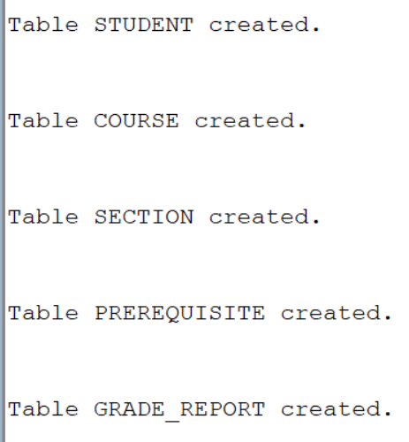
#2.display the description of each table
```DESC STUDENT;
DESC COURSE;```
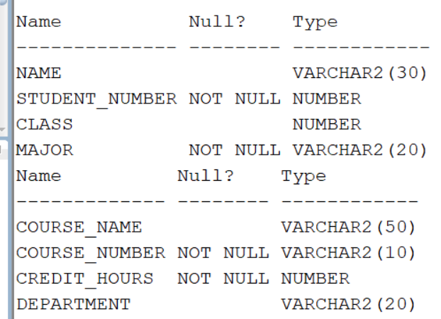
```DESC SECTION;
DESC PREREQUISITE;
DESC GRADE_REPORT;```
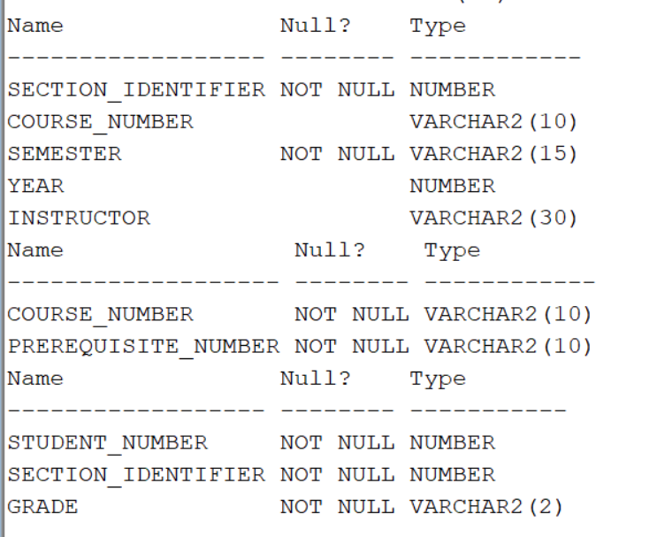
#3.insert the values specified by the above database
```INSERT INTO STUDENT VALUES ('Smith', 17, 1, 'CS');
INSERT INTO STUDENT VALUES ('Brown', 8, 2, 'CS');```
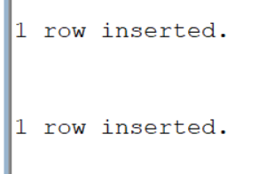
```INSERT INTO COURSE VALUES ('Intro to Computer Science', 'CS1310', 4, 'CS');
INSERT INTO COURSE VALUES ('Data Structures', 'CS3320', 4, 'CS');
INSERT INTO COURSE VALUES ('Discrete Mathematics', 'MATH2410', 3, 'MATH');
INSERT INTO COURSE VALUES ('Database', 'CS3380', 3, 'CS');
```
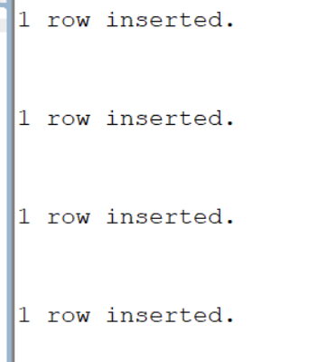
```INSERT INTO SECTION VALUES (85, 'MATH2410', 'Fall', 7, 'King');
INSERT INTO SECTION VALUES (92, 'CS1310', 'Fall', 7, 'Anderson');
INSERT INTO SECTION VALUES (102, 'CS3320', 'Spring', 8, 'Knuth');
INSERT INTO SECTION VALUES (112, 'MATH2410', 'Fall', 8, 'Chang');
INSERT INTO SECTION VALUES (119, 'CS1310', 'Fall', 8, 'Anderson');
INSERT INTO SECTION VALUES (135, 'CS3380', 'Fall', 8, 'Stone');```
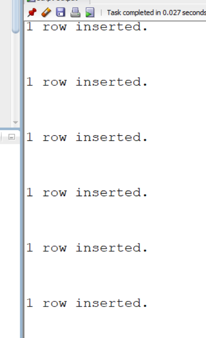
```INSERT INTO GRADE_REPORT VALUES (17, 112, 'B');
INSERT INTO GRADE_REPORT VALUES (17, 119, 'C');
INSERT INTO GRADE_REPORT VALUES (8, 85, 'A');
INSERT INTO GRADE_REPORT VALUES (8, 92, 'A');
INSERT INTO GRADE_REPORT VALUES (8, 102, 'B');
INSERT INTO GRADE_REPORT VALUES (8, 135, 'A');```
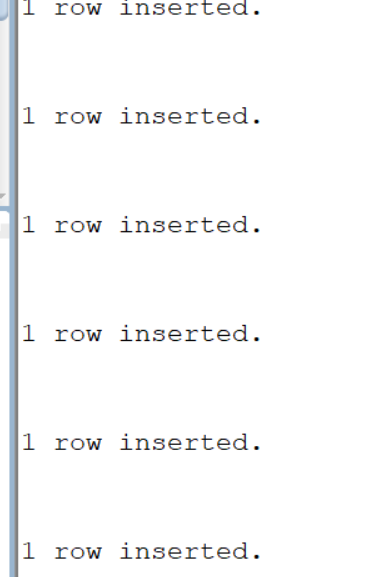
```INSERT INTO PREREQUISITE VALUES('CS3380','CS3320');
INSERT INTO PREREQUISITE VALUES('CS3320','CS1310');
INSERT INTO PREREQUISITE VALUES('CS3380','MATH2410');```
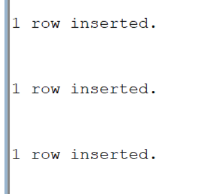
# 4.display the instances of each table
```SELECT * FROM STUDENT;```

```SELECT * FROM COURSE;```
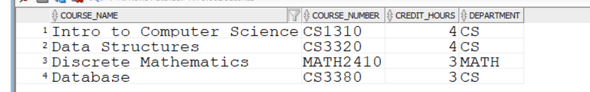
```SELECT * FROM SECTION;```
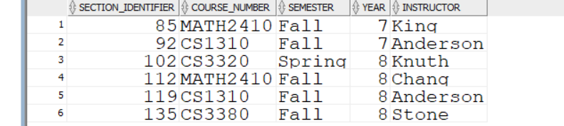
```SELECT * FROM PREREQUISITE;```
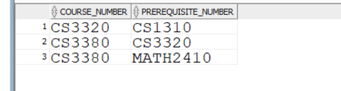
```SELECT * FROM GRADE_REPORT;```
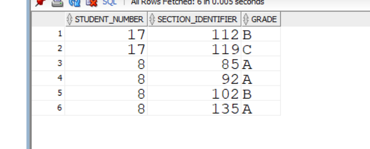
#5,All branch attribute in student table and describe the table
```ALTER TABLE STUDENT
ADD Branch VARCHAR2(20);

DESC STUDENT;```
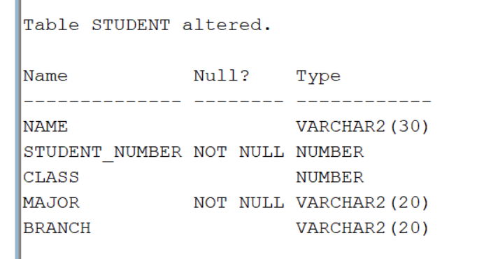
#6.copy major attribute values into branch attribute and display it
```UPDATE STUDENT
SET BRANCH = MAJOR;```

```SELECT MAJOR, BRANCH
FROM STUDENT;```
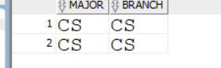
#7.remove major attribute in student
```ALTER TABLE STUDENT
DROP COLUMN MAJOR;```

# 8.change the name of course_number to cid in course and describe it
```ALTER TABLE COURSE
RENAME COLUMN COURSE_NUMBER TO CID;
DESC COURSE;```
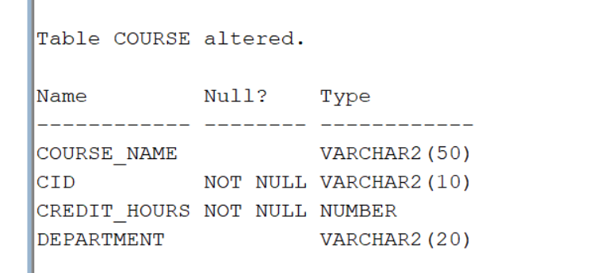
#9.change the value of credit_hrs of database to 4 in course
```UPDATE COURSE
SET CREDIT_HOURS = 4
WHERE COURSE_NAME = 'Database';```

#10.put NOT NULL constraint to column branch in student
```ALTER TABLE STUDENT
MODIFY BRANCH VARCHAR2(20) NOT NULL;```

#11.replace the student name to pupil
```ALTER TABLE STUDENT
RENAME COLUMN NAME TO PUPIL;```

#12.remove the student table
```DROP TABLE STUDENT CASCADE CONSTRAINTS;```

#13.remove the rows of fall semester in section
```DELETE FROM GRADE_REPORT
WHERE SECTION_IDENTIFIER IN
(SELECT SECTION_IDENTIFIER
FROM SECTION
WHERE SEMESTER='FALL');

DELETE FROM SECTION
WHERE SEMESTER ='Fall';```


#14.remove the row of 'data_structure' in the course
```DELETE FROM GRADE_REPORT
WHERE SECTION_IDENTIFIER=102;
DELETE FROM PREREQUISITE
WHERE COURSE_NUMBER='CS3320';
DELETE FROM SECTION
WHERE COURSE_NUMBER='CS3320';
DELETE FROM COURSE
WHERE CID='DATA STRUCTURES';```

#15.remove all rows in all tables using TRUNCATE table
```TRUNCATE TABLE GRADE_REPORT;
TRUNCATE TABLE PREREQUISITE;
TRUNCATE TABLE SECTION;
TRUNCATE TABLE COURSE;```
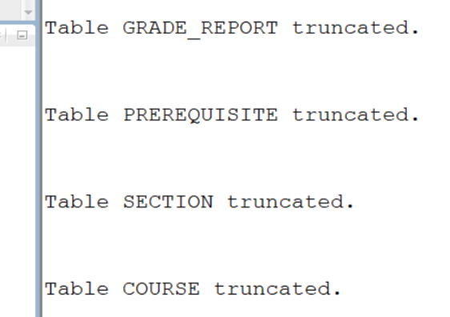
#16.remove pupil,course and section taable so that it exist in recycle bin
```DROP TABLE SECTION CASCADE CONSTRAINTS;
DROP TABLE COURSE CASCADE CONSTRAINTS;
DROP TABLE STUDENT CASCADE CONSTRAINTS;```
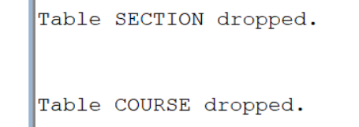
#17.remove the grade report & prerequisites tables permanently
```DROP TABLE GRADE_REPORT PURGE;
DROP TABLE PREREQUISITE PURGE;```
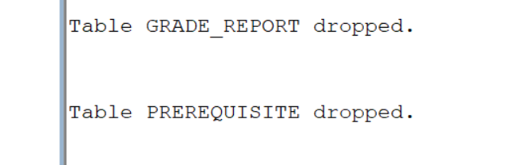 
