#design the given database using DDL and DML commands
```CREATE TABLE Sailors (
    sid NUMBER PRIMARY KEY,
    sname VARCHAR2(20),
    rating NUMBER,
    age NUMBER(4,1)
);
CREATE TABLE Boats (
    bid NUMBER PRIMARY KEY,
    bname VARCHAR2(20),
    color VARCHAR2(10)
);
CREATE TABLE Reserves (
    sid NUMBER,
    bid NUMBER,
    day DATE,
    PRIMARY KEY (sid, bid, day),
    FOREIGN KEY (sid) REFERENCES Sailors(sid),
    FOREIGN KEY (bid) REFERENCES Boats(bid)
);```
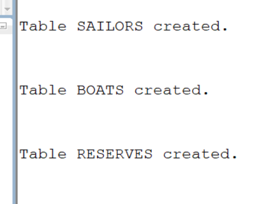
```INSERT INTO Sailors VALUES (22, 'Dustin', 7, 45.0);
INSERT INTO Sailors VALUES (29, 'Brutus', 1, 33.0);
INSERT INTO Sailors VALUES (31, 'Lubber', 8, 55.5);
INSERT INTO Sailors VALUES (32, 'Andy', 8, 25.5);
INSERT INTO Sailors VALUES (35, 'Rusty', 10, 35.0);
INSERT INTO Sailors VALUES (61, 'Horatio', 7, 35.0);
INSERT INTO Sailors VALUES (71, 'Zorba', 10, 16.0);
INSERT INTO Sailors VALUES (74, 'Horatio', 9, 35.0);
INSERT INTO Sailors VALUES (85, 'Art', 3, 25.5);
INSERT INTO Sailors VALUES (95, 'Bob', 3, 63.5);```
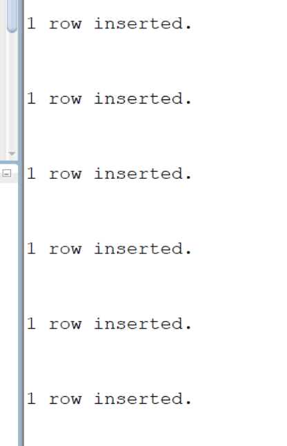
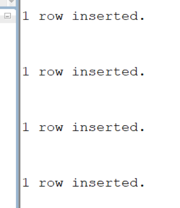
```INSERT INTO Boats VALUES (101, 'Interlake', 'blue');
INSERT INTO Boats VALUES (102, 'Interlake', 'red');
INSERT INTO Boats VALUES (103, 'Clipper', 'green');
INSERT INTO Boats VALUES (104, 'Marine', 'red');```
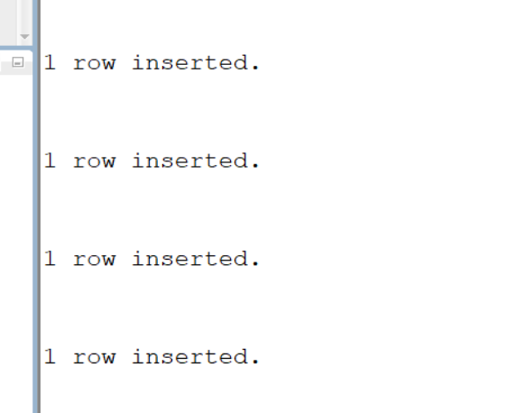
```INSERT INTO Reserves VALUES (22, 101, TO_DATE('10/10/98','DD/MM/RR'));
INSERT INTO Reserves VALUES (22, 102, TO_DATE('10/10/98','DD/MM/RR'));
INSERT INTO Reserves VALUES (22, 103, TO_DATE('10/08/98','DD/MM/RR'));
INSERT INTO Reserves VALUES (22, 104, TO_DATE('10/07/98','DD/MM/RR'));

INSERT INTO Reserves VALUES (31, 102, TO_DATE('11/10/98','DD/MM/RR'));
INSERT INTO Reserves VALUES (31, 103, TO_DATE('11/06/98','DD/MM/RR'));
INSERT INTO Reserves VALUES (31, 104, TO_DATE('11/12/98','DD/MM/RR'));

INSERT INTO Reserves VALUES (64, 101, TO_DATE('09/05/98','DD/MM/RR'));
INSERT INTO Reserves VALUES (64, 102, TO_DATE('09/08/98','DD/MM/RR'));

INSERT INTO Reserves VALUES (74, 103, TO_DATE('09/08/98','DD/MM/RR'));```
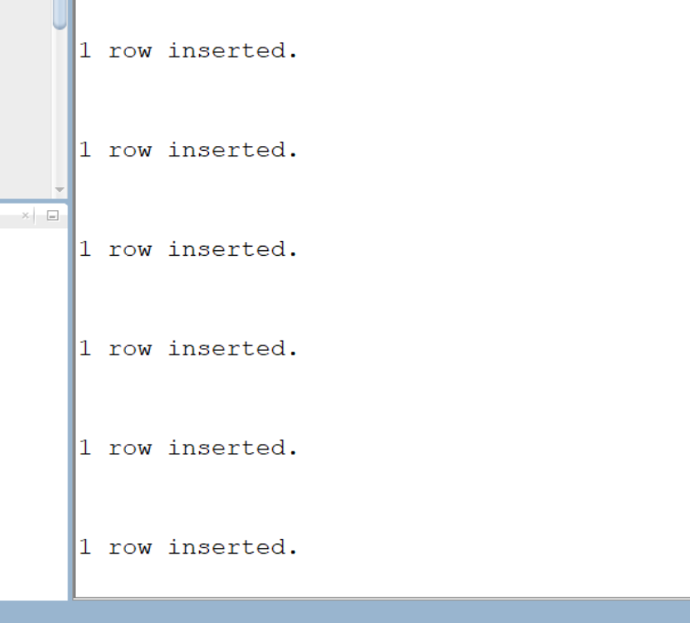
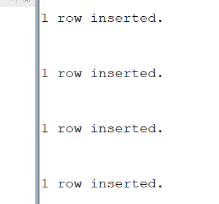
# 1.Find the names and ages of all sailors
```SELECT DISTINCT sname,age FROM sailors;```
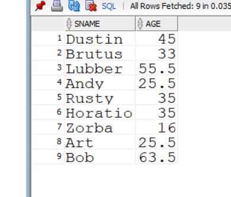
# 2.find all sailors with a rating above 7
```SELECT *FROM sailors WHERE rating>7;```
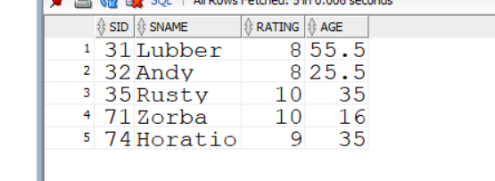
#3.Find the names of sailors who have reserved boat number 103
```SELECT s.sname
FROM Sailors s, Reserves r
WHERE s.sid = r.sid
AND r.bid = 103;```
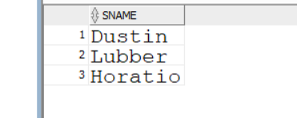
#4.Find the sids of sailors who have reserved a red boat
```SELECT s.sid
FROM Sailors s, Reserves r, Boats b
WHERE s.sid = r.sid
AND r.bid = b.bid
AND b.color = 'red';```
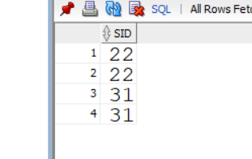
#5.find the names of sailors who have reserved a red boat
```SELECT s.sname
FROM Sailors s, Reserves r, Boats b
WHERE s.sid = r.sid
AND r.bid = b.bid
AND b.color = 'red';```
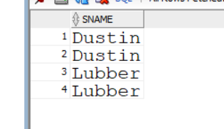
#6.find the colors of boats reserved by lubber
```SELECT b.color
FROM Sailors s, Reserves r, Boats b
WHERE s.sid = r.sid
AND r.bid = b.bid
AND s.sname = 'Lubber';```
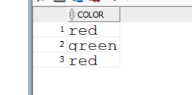
#7.find the names of sailors who have reserved atleast one boat
```SELECT DISTINCT s.sname
FROM Sailors s, Reserves r
WHERE s.sid = r.sid;```
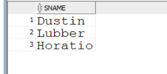
#8,Compute increments for the ratings of the person who have sailed two different boats on the same day
```SELECT DISTINCT s.sname, s.rating
FROM Sailors s, Reserves r1, Reserves r2
WHERE s.sid = r1.sid
  AND s.sid = r2.sid
  AND r1.day = r2.day
  AND r1.bid <> r2.bid;```
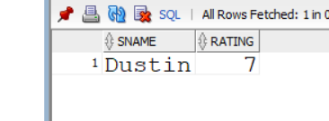
#9.find the ages of sailors whose name begins and ends with B and has atleast three characters
```SELECT age
FROM Sailors
WHERE sname LIKE 'B%B'
  AND LENGTH(sname) >= 3;```

#10.find the names of sailors who reserved a red boat or green boat
```SELECT DISTINCT s.sname
FROM Sailors s, Reserves r, Boats b
WHERE s.sid = r.sid
  AND r.bid = b.bid
  AND b.color = 'red'
UNION
SELECT DISTINCT s.sname
FROM Sailors s, Reserves r, Boats b
WHERE s.sid = r.sid
  AND r.bid = b.bid
  AND b.color = 'green';```
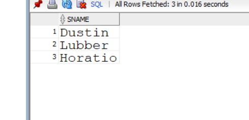
#11.find the names of sailors who have reserved both a red and a green boat
```SELECT DISTINCT s.sname
FROM Sailors s, Reserves r, Boats b
WHERE s.sid = r.sid
  AND r.bid = b.bid
  AND b.color = 'red'
INTERSECT
SELECT DISTINCT s.sname
FROM Sailors s, Reserves r, Boats b
WHERE s.sid = r.sid
  AND r.bid = b.bid
  AND b.color = 'green';```
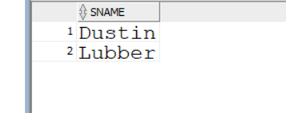
#12.Find the sids of all sailors who have reserved red boats but not green boats
```SELECT DISTINCT s.sid
FROM Sailors s, Reserves r, Boats b
WHERE s.sid = r.sid
  AND r.bid = b.bid
  AND b.color = 'red'
MINUS
SELECT DISTINCT s.sid
FROM Sailors s, Reserves r, Boats b
WHERE s.sid = r.sid
  AND r.bid = b.bid
  AND b.color = 'green';```

#13.find all sids of sailors who have a rating of 10 or have reserved boat 104
```SELECT sid
FROM Sailors
WHERE rating = 10
UNION
SELECT sid
FROM Reserves
WHERE bid = 104;```
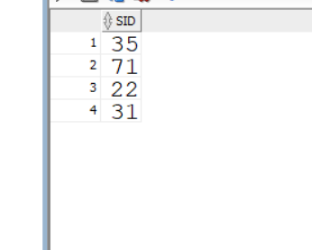
#14.Find the names of sailors who have reserved boat 103
```SELECT sname
FROM Sailors
WHERE sid IN
      (SELECT sid
       FROM Reserves
       WHERE bid = 103);```
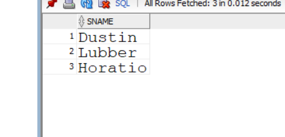
#15.find the names of sailors who have reserved a red boat
```SELECT sname
FROM Sailors
WHERE sid IN
      (SELECT sid
       FROM Reserves
       WHERE bid IN
             (SELECT bid
              FROM Boats
              WHERE color = 'red'));```
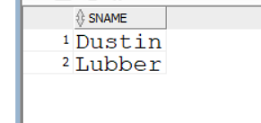
#16.find the nmaes of sailors who have reserved boat number 103
```SELECT sname FROM sailors WHERE sid IN(SELECT sid FROM Reserves WHERE bid=103);```
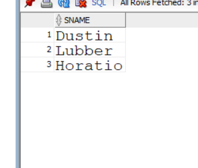
#17.find sailors whose rating is better than some sailor called horatio
```SELECT *FROM sailors WHERE rating>ANY(SELECT rating FROM sailors WHERE sname='Horatio');```
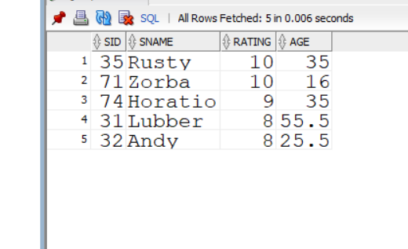
#18.Find sailors whose rating is better than every sailor called horatio
```SELECT *FROM sailors WHERE rating>ALL(SELECT rating FROM sailors WHERE sname='Horatio');```
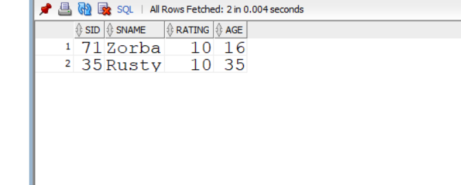
#19.Find the sailors with highest rating
```SELECT *
FROM Sailors
WHERE rating =
      (SELECT MAX(rating)
       FROM Sailors);````
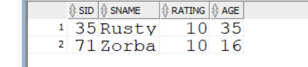
#20.Find the names of the sailors who have reserved both a red and green boat
```SELECT DISTINCT s.sname
FROM Sailors s
WHERE s.sid IN
      (SELECT r.sid
       FROM Reserves r, Boats b
       WHERE r.bid = b.bid
       AND b.color = 'red')
AND s.sid IN
      (SELECT r.sid
       FROM Reserves r, Boats b
       WHERE r.bid = b.bid
       AND b.color = 'green');```
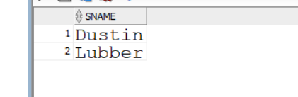
#21.Find the names of sailors who reserved all boats
```SELECT s.sname
FROM Sailors s, Reserves r
WHERE s.sid = r.sid
GROUP BY s.sid, s.sname
HAVING COUNT(DISTINCT r.bid) =
       (SELECT COUNT(*) FROM Boats);```
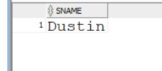
#22.Find the average age of all sailors
```SELECT AVG(age)
FROM Sailors;```
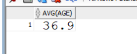
#23.Find the average age of sailors with arating of 10
```SELECT AVG(age)
FROM Sailors
WHERE rating = 10;```

#24.Find the name and age of oldest sailor
```SELECT sname, age
FROM Sailors
WHERE age =
      (SELECT MAX(age)
       FROM Sailors);```

#25.count the number of sailors
```SELECT COUNT(*)
FROM Sailors;```

#26.Count the number of different sailors names
```SELECT COUNT(DISTINCT sname)
FROM Sailors;```

#27.Find the names of the sailors who are older than the oldest sailor with arating of 10
```SELECT sname
FROM Sailors
WHERE age >
      (SELECT MAX(age)
       FROM Sailors
       WHERE rating = 10);```
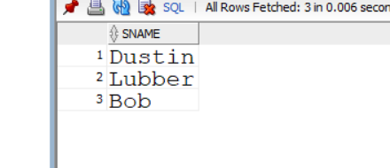
#28.find the age of youngest sailor for each rating level
```SELECT rating, MIN(age)
FROM Sailors
GROUP BY rating;```
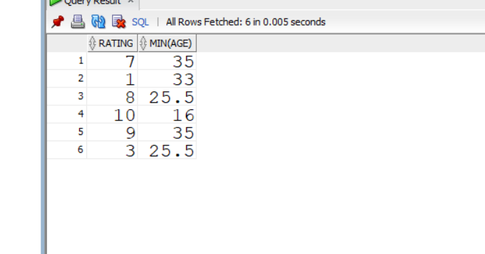
#29.Find the age of youngest sailor who is eligible to vote(i.e., at least 18 years old) for each rating level with at least two such sailors
```SELECT rating, AVG(age)
FROM Sailors
GROUP BY rating
HAVING COUNT(*) >= 2;```
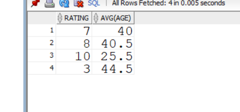
#30.for each red boat , find the number of reservations for this boat
```SELECT b.bid, COUNT(r.sid) AS reservation_count
FROM Boats b, Reserves r
WHERE b.bid = r.bid
AND b.color = 'red'
GROUP BY b.bid;```
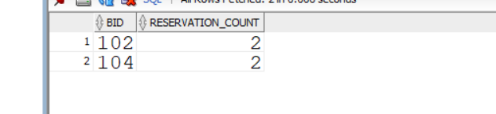
#31.find the average age of sailors for each rating level that has at least two sailors
```SELECT rating, AVG(age)
FROM Sailors
WHERE age >= 18
GROUP BY rating
HAVING COUNT(*) >= 2;```
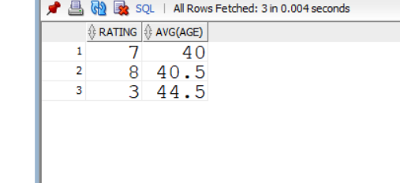
#32.find the average age of sailors who are pf voting age for each rating level that has at least two sailors
```SELECT rating, AVG(s.age) FROM sailors s WHERE s.age>=18
FROM Sailors
GROUP BY rating;```
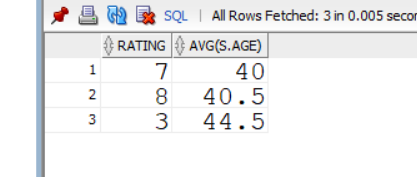
#33.find the average age of sailors who are of voting age for each voting level that has atleast two such sailors
```SELECT s.rating, AVG(s.age)
FROM Sailors s
WHERE s.age >= 18
GROUP BY s.rating
HAVING COUNT(*) >= 2;```

#34.Find those ratings for which the average age of sailors is the minimum over all ratings
```SELECT s1.rating
FROM Sailors s1
GROUP BY s1.rating
HAVING AVG(s1.age) <= ALL
       (SELECT AVG(s2.age)
        FROM Sailors s2
        GROUP BY s2.rating);```
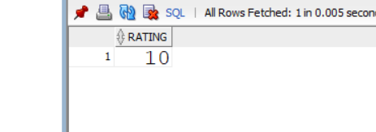
