#design the employee table
```CREATE TABLE EMPLOYEE (
    EMPLOYEE_ID NUMBER(5) PRIMARY KEY,
    FIRST_NAME VARCHAR2(20),
    LAST_NAME VARCHAR2(20),
    GENDER CHAR(1),
    JOB_ID VARCHAR2(15),
    DEPARTMENT VARCHAR2(30),
    SALARY NUMBER(8,2),
    COMMISSION NUMBER(5,2),
    HIRE_DATE DATE,
    CITY VARCHAR2(20)
);```

#insertion
```INSERT INTO EMPLOYEE VALUES
(101, 'John', 'Smith', 'M', 'IT_PROG', 'IT', 65000, 5, TO_DATE('15-JAN-2020','DD-MON-YYYY'), 'Hyderabad');
INSERT INTO EMPLOYEE VALUES
(102, 'Anita', 'Sharma', 'F', 'HR_REP', 'HR', 52000, 3, TO_DATE('10-JUN-2019','DD-MON-YYYY'), 'Bengaluru');
INSERT INTO EMPLOYEE VALUES
(103, 'Rahul', 'Kumar', 'M', 'SA_REP', 'Sales', 48000, 8, TO_DATE('25-AUG-2021','DD-MON-YYYY'), 'Chennai');
INSERT INTO EMPLOYEE VALUES
(104, 'Priya', 'Reddy', 'F', 'MK_MAN', 'Marketing', 72000, 10, TO_DATE('05-MAR-2018','DD-MON-YYYY'), 'Hyderabad');
INSERT INTO EMPLOYEE VALUES
(105, 'David', 'Wilson', 'M', 'FI_ACCOUNT', 'Finance', 58000, NULL, TO_DATE('18-DEC-2017','DD-MON-YYYY'), 'Mumbai');
INSERT INTO EMPLOYEE VALUES
(106, 'Sneha', 'Patel', 'F', 'IT_PROG', 'IT', 69000, 6, TO_DATE('12-NOV-2022','DD-MON-YYYY'), 'Pune');
INSERT INTO EMPLOYEE VALUES
(107, 'Amit', 'Verma', 'M', 'SA_REP', 'Sales', 45000, 4, TO_DATE('20-JUL-2023','DD-MON-YYYY'), 'Delhi');
INSERT INTO EMPLOYEE VALUES
(108, 'Kiran', 'Rao', 'M', 'HR_REP', 'HR', 50000, NULL, TO_DATE('09-FEB-2021','DD-MON-YYYY'), 'Hyderabad');
INSERT INTO EMPLOYEE VALUES
(109, 'Lakshmi', 'Nair', 'F', 'IT_PROG', 'IT', 76000, 7, TO_DATE('14-SEP-2016','DD-MON-YYYY'), 'Kochi');
INSERT INTO EMPLOYEE VALUES
(110, 'Arjun', 'Singh', 'M', 'MK_MAN', 'Marketing', 68000, 5, TO_DATE('30-APR-2019','DD-MON-YYYY'), 'Jaipur');```
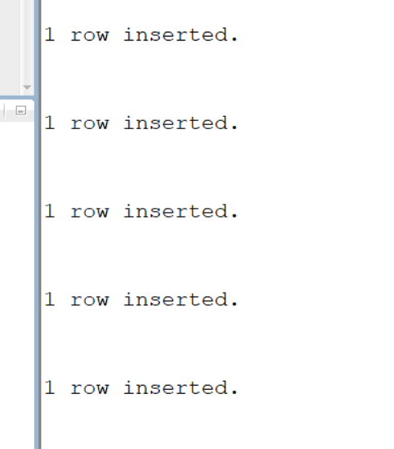
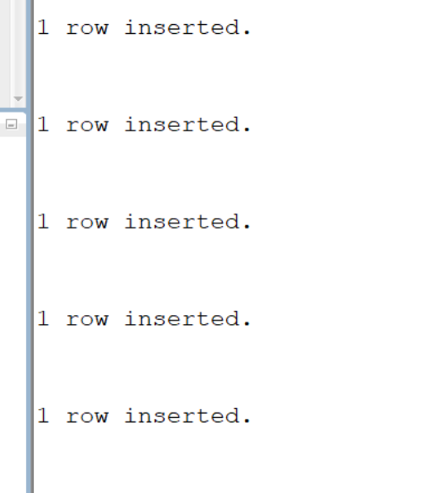
#1.Write an SQL query to display the employee ID,first name, and hire date in the format DD-MON-YYY using the TO_CHAR function
```SELECT EMPLOYEE_ID, FIRST_NAME,
       TO_CHAR(HIRE_DATE, 'DD-MON-YYYY') AS HIRE_DATE
FROM EMPLOYEE;```
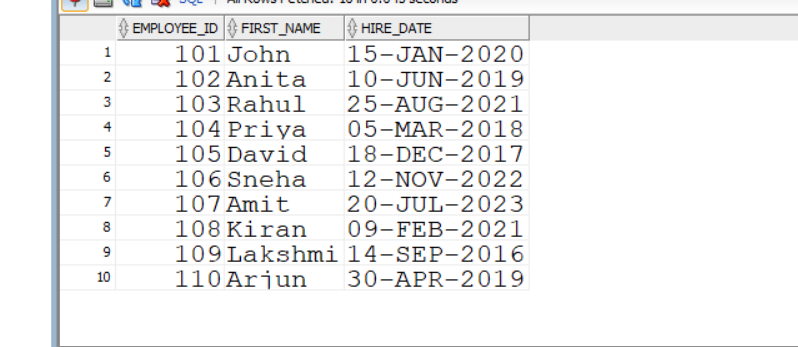
#2.Write an SQL query to display the employee ID,first name, and salary formatted with a currency symbol using the TO_CHAR function
```SELECT EMPLOYEE_ID, FIRST_NAME,
       TO_CHAR(SALARY, 'L99,999.00') AS SALARY
FROM EMPLOYEE;```
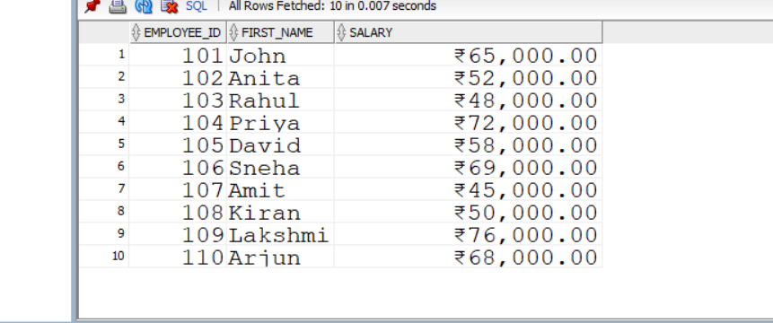
#3.Write an SQL query to add 5000 to each employee's salary using the TO_NUMBER function
```SELECT EMPLOYEE_ID, FIRST_NAME,
       TO_NUMBER(TO_CHAR(SALARY)) + 5000 AS NEW_SALARY
FROM EMPLOYEE;```
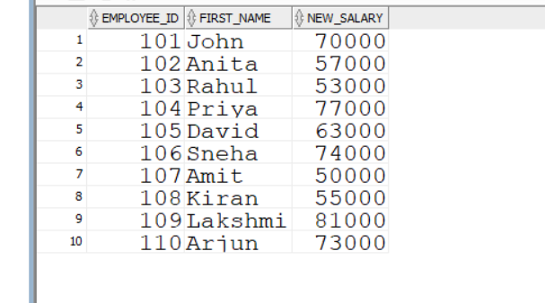
#4.Write an SQL query to display the details of employees who were hired after 01-JAN-2020
```SELECT *
FROM EMPLOYEE
WHERE HIRE_DATE > TO_DATE('01-JAN-2020', 'DD-MON-YYYY');```
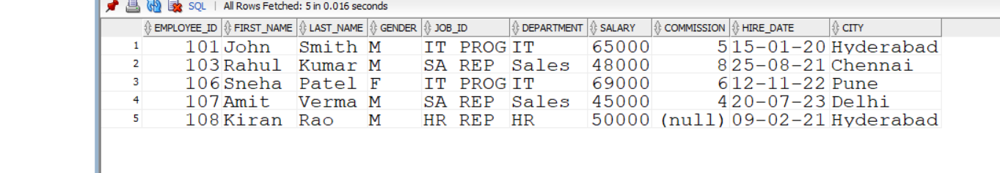
#5.Write an SQL query to display the full name of each employee by concatenating the first name and last name using the concatenation(||) operator
```SELECT FIRST_NAME || ' ' || LAST_NAME AS FULL_NAME
FROM EMPLOYEE;```
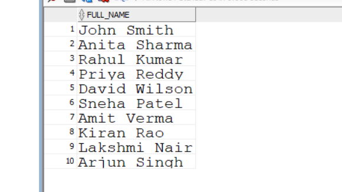
#6.Write an SQL query to concatenate the first name and last name of each employee using the CONCAT function
```SELECT CONCAT(FIRST_NAME, LAST_NAME) AS FULL_NAME
FROM EMPLOYEE;```
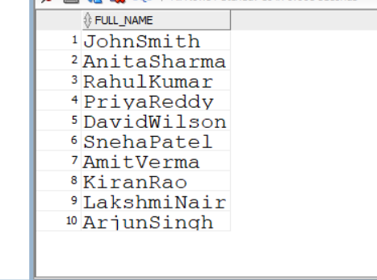
#7.Write an SQL query to display each employee's first name left padded with * characters using the LPAD function
```SELECT LPAD(FIRST_NAME, 10, '*') AS FIRST_NAME
FROM EMPLOYEE;```
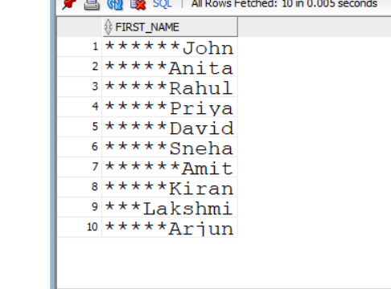
#8.Write an SQL query to display each employee's first name right-padded with * characters using the RPAD function.
```SELECT RPAD(FIRST_NAME, 10, '*') AS FIRST_NAME
FROM EMPLOYEE;
```
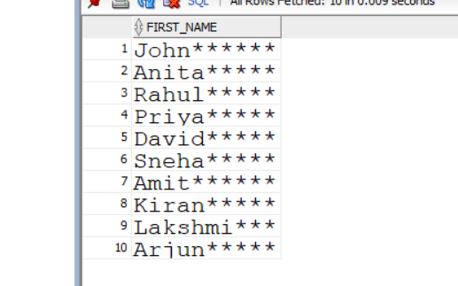
#9.Write an SQL query to remove leading spaces from employee names using the LTRIM function
```SELECT LTRIM(FIRST_NAME) AS FIRST_NAME
FROM EMPLOYEE;```
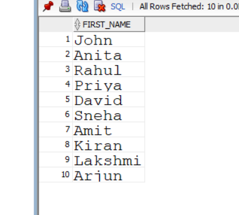
#10.Write an SQL query to remove trailing spaces from employee names using the RTRIM function
```SELECT RTRIM(FIRST_NAME) AS FIRST_NAME
FROM EMPLOYEE;```
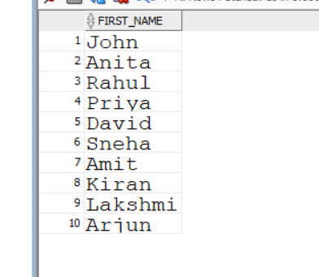
#11.write an SQL query to display all employee first names in lowercase using The LOWER function
```SELECT LOWER(FIRST_NAME) AS FIRST_NAME
FROM EMPLOYEE;```
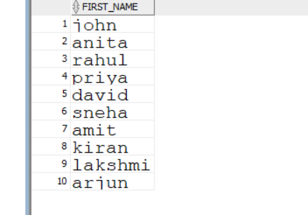
#12.write an SQL query to display all employee first names in uppercase using the UPPER function
```SELECT UPPER(FIRST_NAME) AS FIRST_NAME
FROM EMPLOYEE;
```
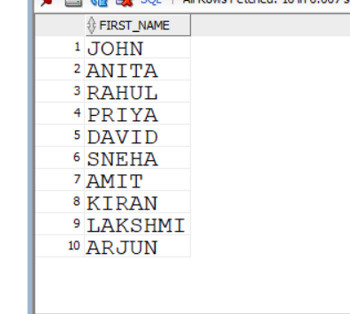
#13.Write an sql query to display employee first names in proper case using the INITCAP function
```SELECT INITCAP(FIRST_NAME) AS FIRST_NAME
FROM EMPLOYEE;```
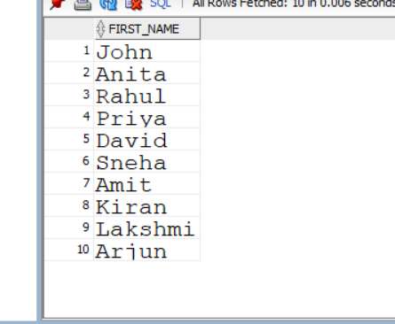
#14.Write an SQL query to display the length of each employee's first name using the LENGTH function
```SELECT FIRST_NAME,
       LENGTH(FIRST_NAME) AS NAME_LENGTH
FROM EMPLOYEE;
```
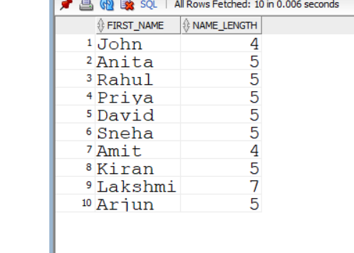
#15.Write an SQL query to display the first three characters of each employee's first name using the SUBSTR function
```SELECT FIRST_NAME,
       SUBSTR(FIRST_NAME, 1, 3) AS FIRST_THREE
FROM EMPLOYEE;```
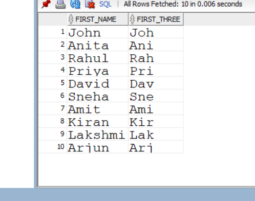
#16.Write an SQL query to find the position of the character 's' in each employee's first name using the INSTR function.
```SELECT FIRST_NAME,
       INSTR(FIRST_NAME, 'a') AS POSITION
FROM EMPLOYEE;```
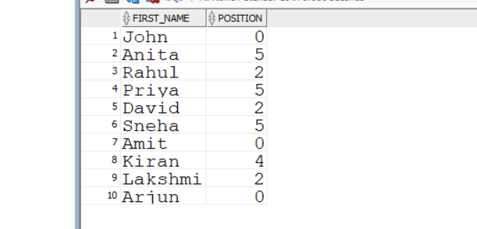
#17.Write an SQL query to display the current system date along with each employee's details using theSYSDATE function.
```SELECT EMPLOYEE_ID, FIRST_NAME, SYSDATE AS CURRENT_DATE
FROM EMPLOYEE;```
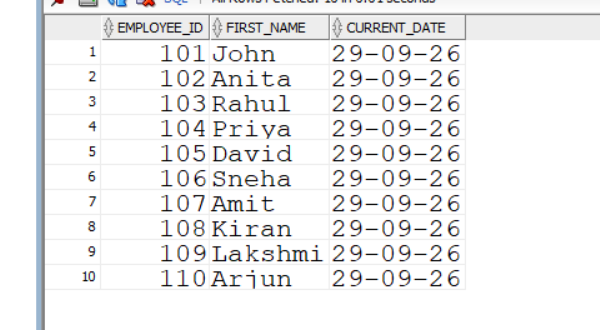
#18.Write an SQL quety to display the next monday after each employee's hire date using the NEXT_DAY fumction
```SELECT EMPLOYEE_ID, FIRST_NAME, HIRE_DATE,
       NEXT_DAY(HIRE_DATE, 'MONDAY') AS NEXT_MONDAY
FROM EMPLOYEE;```
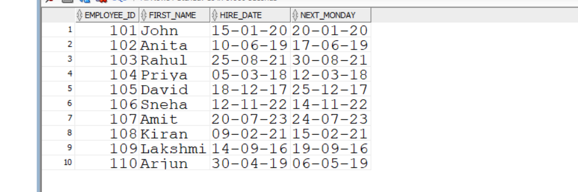
#19.Write an SQL query to display the date obtained by adding six months to each employee's hire date using the ADD_MONTHS function
```SELECT EMPLOYEE_ID, FIRST_NAME, HIRE_DATE,
       ADD_MONTHS(HIRE_DATE, 6) AS NEW_DATE
FROM EMPLOYEE;
```
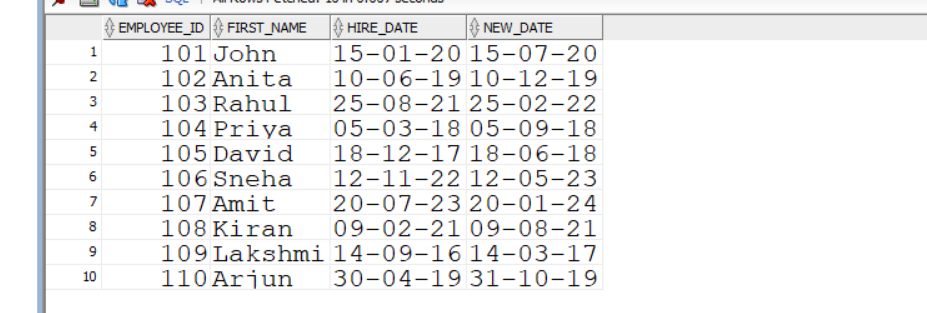
#20.Write an sql query to display the last date of the month for each employee's hire date using the LAST_DATE function
```SELECT EMPLOYEE_ID, FIRST_NAME, HIRE_DATE,
       LAST_DAY(HIRE_DATE) AS LAST_DAY
FROM EMPLOYEE;```
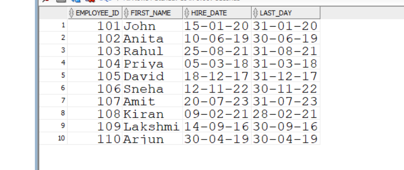
#21.Write an SQL query to calculate the total number of months each employee has worked using the MONTHS_BETWEEN function
```SELECT EMPLOYEE_ID, FIRST_NAME,
       MONTHS_BETWEEN(SYSDATE, HIRE_DATE) AS MONTHS_WORKED
FROM EMPLOYEE;```
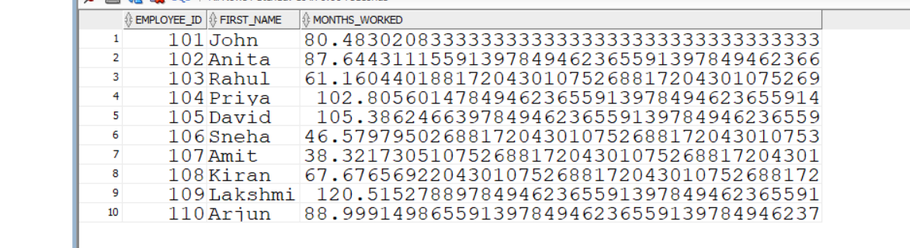
#22.Write an SQL query to display the smaller value between each employee's salary and 60000 using the LEAST function
```SELECT EMPLOYEE_ID, FIRST_NAME,
       LEAST(SALARY, 60000) AS SMALLER_VALUE
FROM EMPLOYEE;```
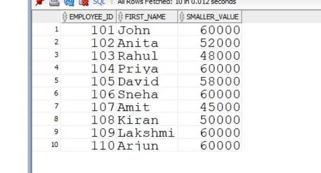
#23.write an SQL query to display the greater value between each employee's salary and 60000 using the GREATEST function.
```SELECT EMPLOYEE_ID, FIRST_NAME,
       GREATEST(SALARY, 60000) AS GREATER_VALUE
FROM EMPLOYEE;```
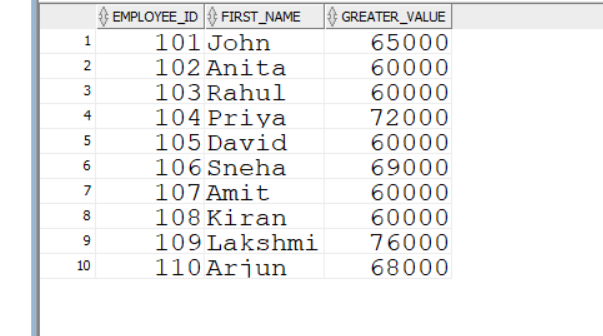
#24.Write an SQL query to display the first day of the month of each employee's hire date using the TRUNC function
```SELECT EMPLOYEE_ID, FIRST_NAME, HIRE_DATE,
       TRUNC(HIRE_DATE, 'MONTH') AS FIRST_DAY
FROM EMPLOYEE;```
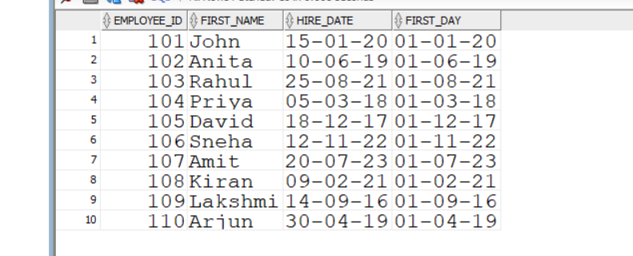
