#1.Write an SQL query to create a view named EMP_VIEW that displays all columns from the EMPLOYEES table.
```CREATE VIEW EMP_VIEW AS
SELECT *
FROM EMPLOYEE;```
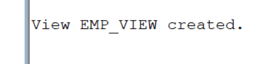
#2.Write an SQL query to create a view named EMP_BASIC that displays the Employee ID, First Name, Last Name, Department, and Salary.
```CREATE VIEW EMP_BASIC AS
SELECT employee_id, first_name, last_name, department, salary
FROM EMPLOYEE;```
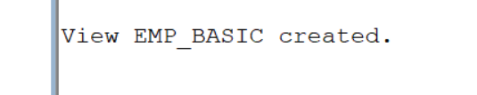
#3.Write an SQL query to display all records from the EMP_VIEW.
```SELECT *
FROM EMP_VIEW;```
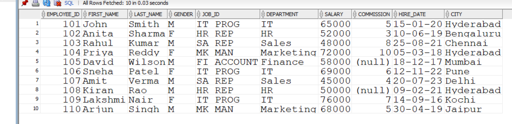
#4.Write an SQL query to create a view named IT_EMPLOYEES that displays the details of employees working in the IT department.
```CREATE VIEW IT_EMPLOYEES AS
SELECT *
FROM EMPLOYEE
WHERE department = 'IT';```

#5.Write an SQL query to create a view named HIGH_SALARY that displays employees whose salary is greater than ₹60,000.
```CREATE VIEW HIGH_SALARY AS
SELECT *
FROM EMPLOYEE
WHERE salary > 60000;```
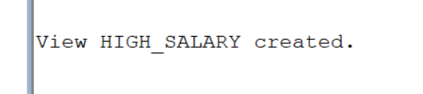
#6.Write an SQL query to create a view named HYDERABAD_EMP that displays employees whose city is Hyderabad.
```CREATE VIEW HYDERABAD_EMP AS
SELECT *
FROM EMPLOYEE
WHERE city = 'Hyderabad';```

#7.Write an SQL query to create a view named FEMALE_EMP that displays the details of all female employees.
```CREATE VIEW FEMALE_EMP AS
SELECT *
FROM EMPLOYEE
WHERE gender = 'F';```
#8.Write an SQL query to create a view named RECENT_EMPLOYEES that displays employees hired on or after 01-JAN-2020.
```CREATE VIEW RECENT_EMPLOYEES AS
SELECT *
FROM EMPLOYEE
WHERE hire_date >= TO_DATE('01-JAN-2020', 'DD-MON-YYYY');```

#9.Write an SQL query to display the Employee ID, First Name, and Salary from the HIGH_SALARY view.
```SELECT employee_id, first_name, salary
FROM HIGH_SALARY;```
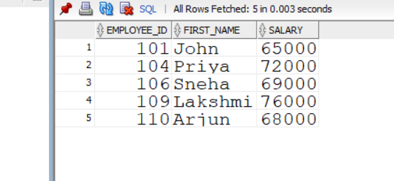
#10.Write an SQL query to replace the EMP_BASIC view by adding the CITY column using the CREATE OR REPLACE VIEW statement.
```CREATE OR REPLACE VIEW EMP_BASIC AS
SELECT employee_id, first_name, last_name, department, salary, city
FROM EMPLOYEE;```

#11.Write an SQL query to create a read-only view named EMP_SALARY_VIEW that displays the Employee ID, First Name, Last Name, and Salary.
```CREATE VIEW EMP_SALARY_VIEW AS
SELECT employee_id, first_name, last_name, salary
FROM EMPLOYEE
WITH READ ONLY;```

#12.Write an SQL query to create a view named SALES_EMP that displays employees belonging to the Sales department using the WITH CHECK OPTION clause.
```CREATE VIEW SALES_EMP AS
SELECT *
FROM EMPLOYEE
WHERE department = 'Sales'
WITH CHECK OPTION;```
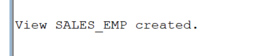
#13.Write an SQL query to update the salary of employee 101 through the EMP_BASIC view.
```UPDATE EMP_BASIC
SET salary = 70000
WHERE employee_id = 101;

COMMIT;```
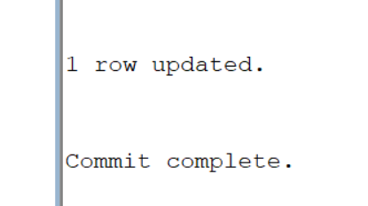
#14.Write an SQL query to delete the details of employee 107 through the EMP_VIEW.
```DELETE FROM EMP_VIEW
WHERE employee_id = 107;```
#15.Write an SQL query to insert a new employee into the EMP_BASIC view.
```INSERT INTO EMP_BASIC
(employee_id, first_name, last_name, department, salary, city)
V2ALUES
2(111, 'Rahul', 'Kumar', 'IT', 65000, 'Hyderabad');```
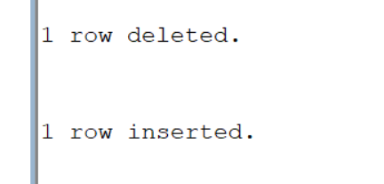
#16.Write an SQL query to display the structure of the EMP_BASIC view.
```DESC EMP_BASIC;```
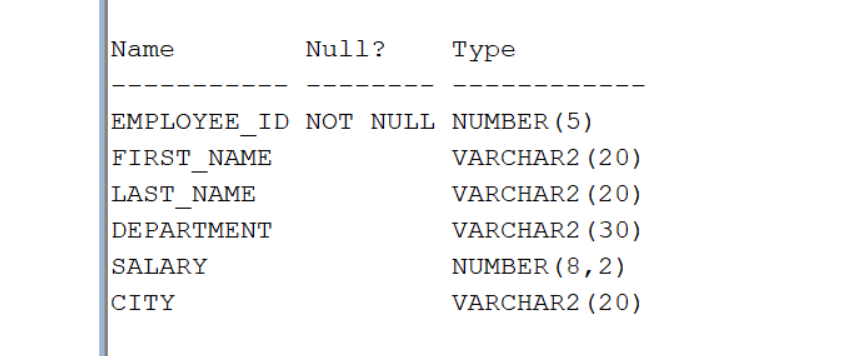
#17.Write an SQL query to display all records from the IT_EMPLOYEES view.
```SELECT *
FROM IT_EMPLOYEE;```
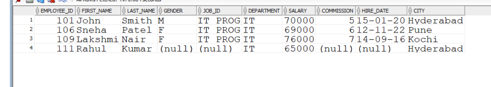
#18.Write an SQL query to display employees from the HIGH_SALARY view whose salary is greater than ₹70,000.
```SELECT *
FROM HIGH_SALARY
WHERE salary > 70000;```
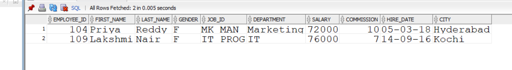
#19.Write an SQL query to display all female employees from the FEMALE_EMP view.
```SELECT *
FROM FEMALE_EMP;```
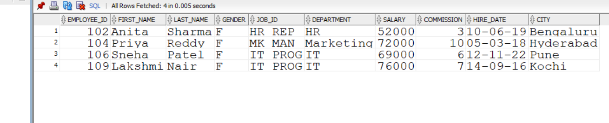
#20.Write an SQL query to display the names and salaries of employees from the HYDERABAD_EMP view.
```SELECT first_name, last_name, salary
FROM HYDERABAD_EMP;```
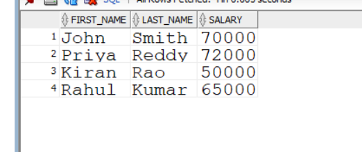
#21.Write an SQL query to drop the EMP_VIEW.
```DROP VIEW EMP_VIEW;```
#22.DROP VIEW HIGH_SALARY
```DROP VIEW HIGH_SALARY;```
#23.DROP VIEW EMP_BASIC
```DROP VIEW EMP_BASIC;```
#24.Write an SQL query to create a view named HR_EMPLOYEES that displays employees working in the HR department.
```CREATE VIEW HR_EMPLOYEES AS
SELECT *
FROM EMPLOYEES
WHERE department = 'HR';```
#25.Write an SQL query to create a view named MARKETING_EMP that displays the Employee ID, First Name, Department, and Salary of employees working in the Marketing department.
```CREATE VIEW MARKETING_EMP AS
SELECT employee_id, first_name, department, salary
FROM EMPLOYEES
WHERE department = 'Marketing';```
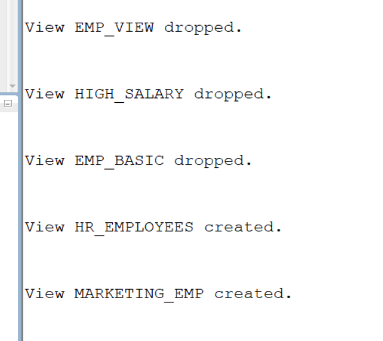
#26.Write an SQL query to create a view named TOP_EARNERS that displays employees earning more than ₹70,000.
```CREATE VIEW TOP_EARNERS AS
SELECT *
FROM EMPLOYEES
WHERE salary > 70000;```
#27.Write an SQL query to create a view named EMP_CITY that displays the Employee ID, First Name, Last Name, and City of all employees.
```CREATE VIEW EMP_CITY AS
SELECT employee_id, first_name, last_name, city
FROM EMPLOYEES;```
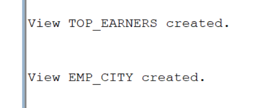


