#1.Create a dept table having dno, dname as columns.
```CREATE TABLE DEPT (
    DNO NUMBER,
    DNAME VARCHAR2(30)
);```
#2.Apply 'Primary Key Constraint' for dno and NOT NULL Constraint for dname to dept table.
```ALTER TABLE DEPT
ADD CONSTRAINT PK_DEPT PRIMARY KEY (DNO);

ALTER TABLE DEPT
MODIFY DNAME NOT NULL;
```
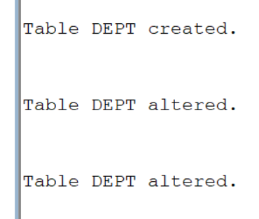
#3.Create a student table having sid, sname, and did as columns.
```CREATE TABLE STUDENT (
    SID NUMBER,
    SNAME VARCHAR2(30),
    DID NUMBER
);```
#4.Apply Primary Key Constraint to sid, NOT NULL Constraint to Sname and Foreign Key Constraint to did refers to dept table.
```ALTER TABLE STUDENT
ADD CONSTRAINT PK_STUDENT PRIMARY KEY (SID);

ALTER TABLE STUDENT
MODIFY SNAME NOT NULL;

ALTER TABLE STUDENT
ADD CONSTRAINT FK_STUDENT_DEPT
FOREIGN KEY (DID)
REFERENCES DEPT(DNO);```
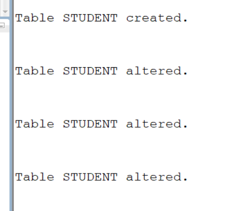
#5.Insert all department details like cse, me, ce, eee, ece, csm, csd in the dept table.
```INSERT INTO DEPT VALUES (1, 'CSE');
INSERT INTO DEPT VALUES (2, 'ME');
INSERT INTO DEPT VALUES (3, 'CE');
INSERT INTO DEPT VALUES (4, 'EEE');
INSERT INTO DEPT VALUES (5, 'ECE');
INSERT INTO DEPT VALUES (6, 'CSM');
INSERT INTO DEPT VALUES (7, 'CSD');```
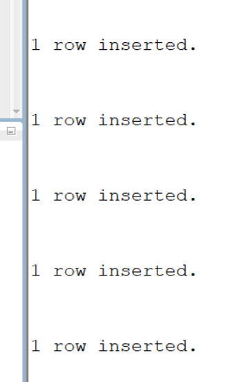
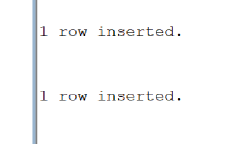
#6.Insert at least 10 rows in the student table, take values of your own.
```INSERT INTO STUDENT VALUES (101, 'Rahul', 1);
INSERT INTO STUDENT VALUES (102, 'Anita', 2);
INSERT INTO STUDENT VALUES (103, 'Priya', 3);
INSERT INTO STUDENT VALUES (104, 'Kiran', 4);
INSERT INTO STUDENT VALUES (105, 'Sneha', 5);
INSERT INTO STUDENT VALUES (106, 'Arjun', 6);
INSERT INTO STUDENT VALUES (107, 'Divya', 7);
INSERT INTO STUDENT VALUES (108, 'Ravi', 1);
INSERT INTO STUDENT VALUES (109, 'Pooja', 5);
INSERT INTO STUDENT VALUES (110, 'Akhil', 6);```
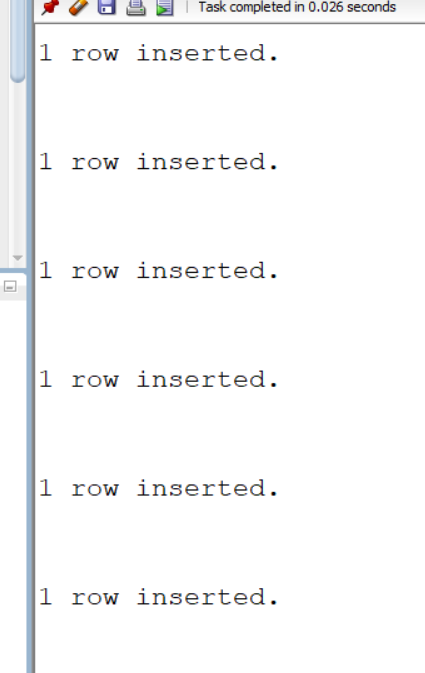
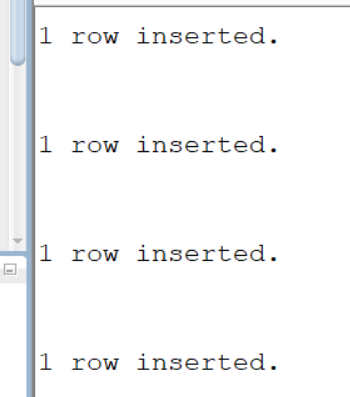
#7.Write a SQL Query to implement NATURAL JOIN between Student and Dept.
```SELECT SID, SNAME, DID, DNAME
FROM STUDENT
NATURAL JOIN
(
    SELECT DNO AS DID, DNAME
    FROM DEPT
);```
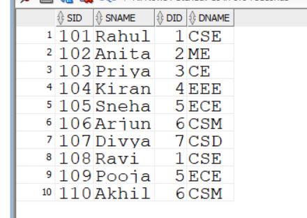
#8.Write a SQL Query to implement EQUI JOIN between Student and Dept.
```SELECT S.SID, S.SNAME, S.DID, D.DNAME
FROM STUDENT S, DEPT D
WHERE S.DID = D.DNO;```
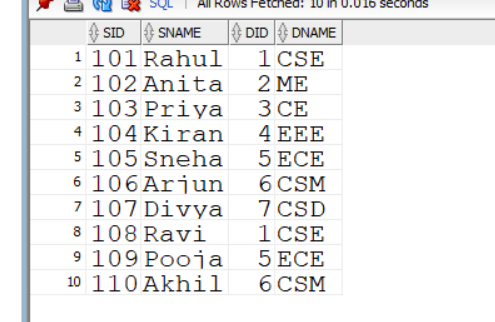
#9.Write a SQL Query to implement CONDITIONAL JOIN between Student and Dept.
```SELECT S.SID, S.SNAME, S.DID, D.DNAME
FROM STUDENT S, DEPT D
WHERE S.DID = D.DNO
AND S.SID > 105;```
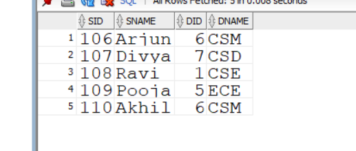
#10.Write a SQL Query to implement LEFT OUTER NATURAL JOIN between Student and Dept.
```SELECT SID, SNAME, DID, DNAME
FROM STUDENT
NATURAL LEFT OUTER JOIN DEPT;```
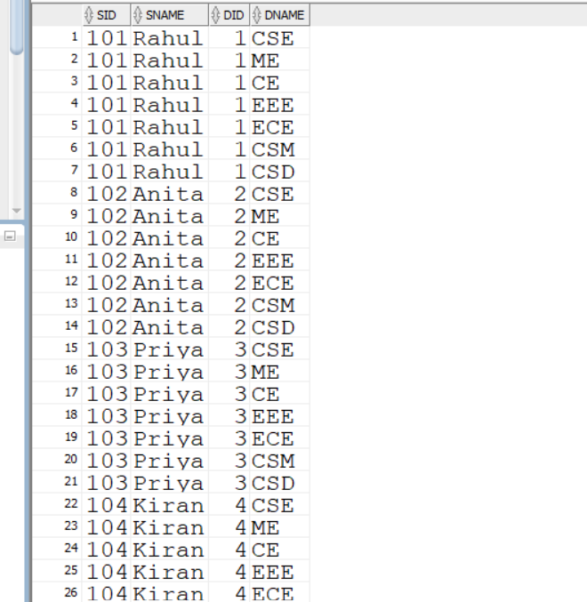
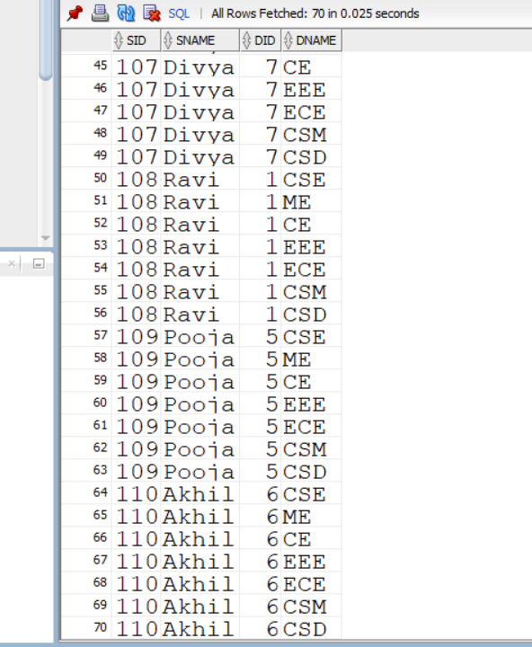
#11.Write a SQL Query to implement RIGHT OUTER NATURAL JOIN between Student and Dept.
```SELECT SID, SNAME, DID, DNAME
FROM STUDENT
NATURAL RIGHT OUTER JOIN DEPT;```
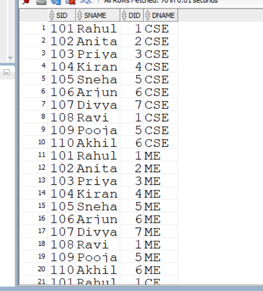
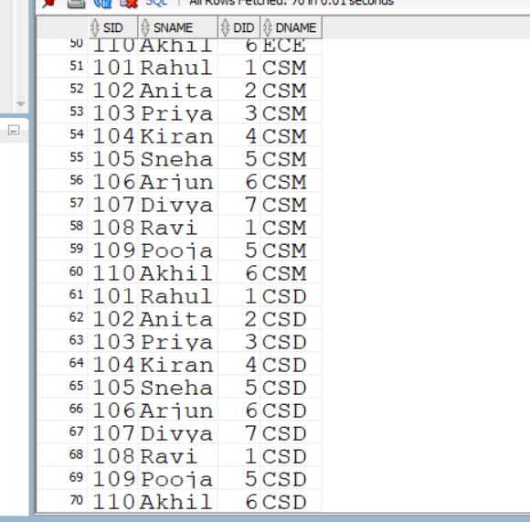
#12.Write a SQL Query to implement FULL OUTER NATURAL JOIN between Student and Dept.
```SELECT SID, SNAME, DID, DNAME
FROM STUDENT
NATURAL FULL OUTER JOIN DEPT;```
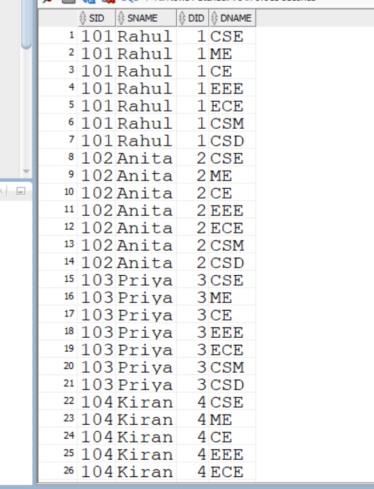
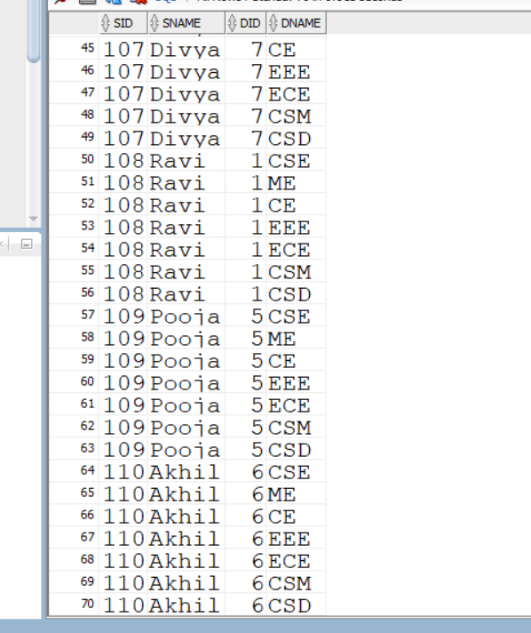
#13.Write a SQL Query to implement LEFT OUTER EQUI JOIN between Student and Dept
```SELECT S.SID, S.SNAME, S.DID, D.DNAME
FROM STUDENT S
LEFT OUTER JOIN DEPT D
ON S.DID = D.DNO;```
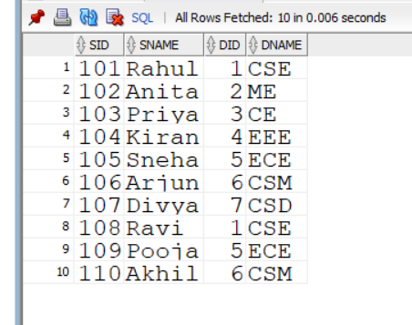
#14.Write a SQL Query to implement RIGHT OUTER EQUI JOIN between Student and Dept.
```SELECT S.SID, S.SNAME, S.DID, D.DNAME
FROM STUDENT S
RIGHT OUTER JOIN DEPT D
ON S.DID = D.DNO;```
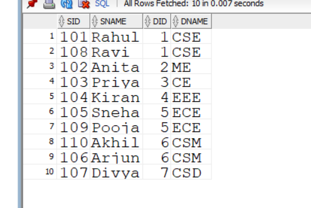
#15.Write a SQL Query to implement FULL OUTER EQUI JOIN between Student and Dept.
```SELECT S.SID, S.SNAME, S.DID, D.DNAME
FROM STUDENT S
FULL OUTER JOIN DEPT D
ON S.DID = D.DNO;```
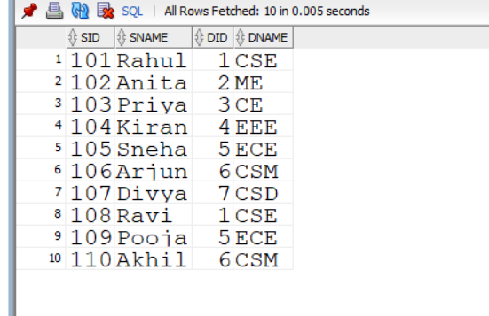
#16.Write a SQL Query to implement LEFT OUTER CONDITIONAL JOIN between Student and Dept.
```SELECT S.SID, S.SNAME, S.DID, D.DNAME
FROM STUDENT S
LEFT OUTER JOIN DEPT D
ON S.DID = D.DNO;```
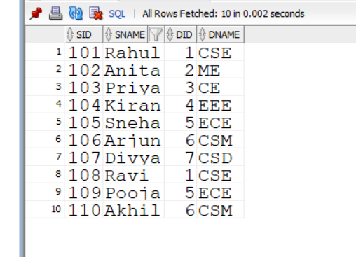
#17.Write a SQL Query to implement RIGHT OUTER CONDITIONAL JOIN between Student and Dept.
```SELECT S.SID, S.SNAME, S.DID, D.DNAME
FROM STUDENT S
RIGHT OUTER JOIN DEPT D
ON S.DID = D.DNO;```
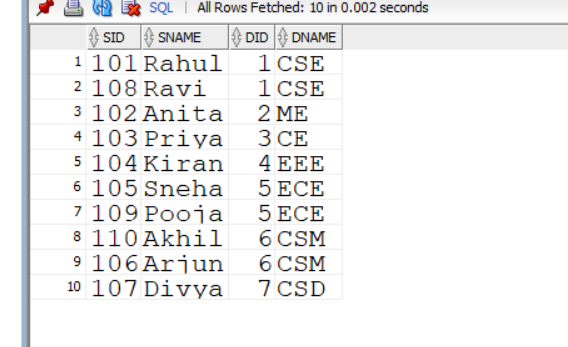
#18.Write a SQL Query to implement FULL OUTER CONDITIONAL JOIN between Student and Dept.
```SELECT S.SID, S.SNAME, S.DID, D.DNAME
FROM STUDENT S
FULL OUTER JOIN DEPT D
ON S.DID = D.DNO;```
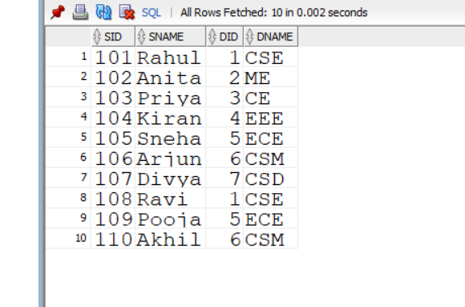
#19.Write a SQL Query to Implement CROSS JOIN between Student and Dept.
```SELECT S.SID, S.SNAME, D.DNO, D.DNAME
FROM STUDENT S
CROSS JOIN DEPT D;```
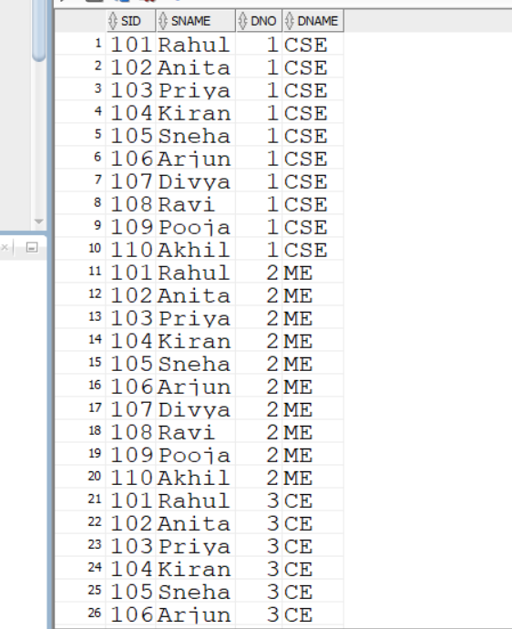
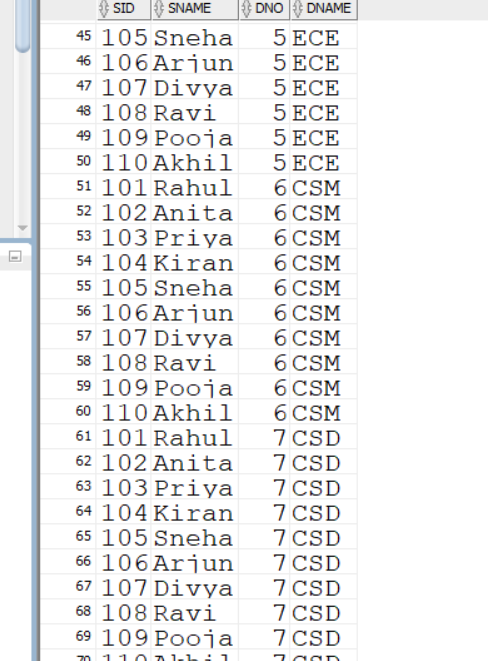
