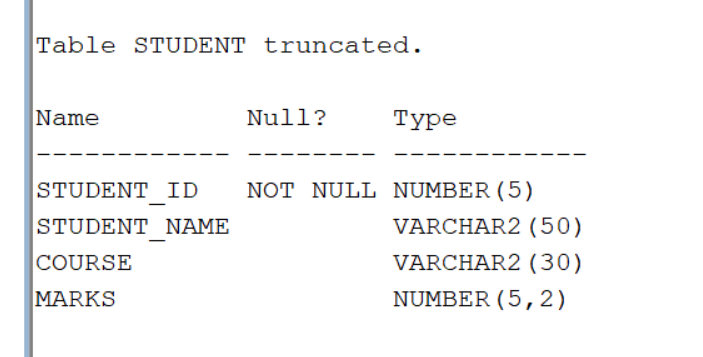
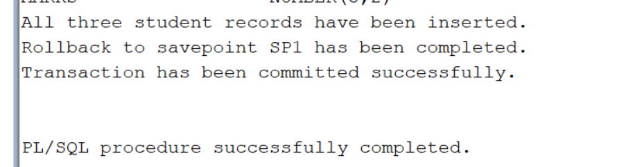

#Trunacte the table
```TRUNCATE table student;```
#Describe the table
```DESC student;```

#Display the student table
```SELECT *FROM student;```

#PL/sQL source Code
```SET SERVEROUTPUT ON;

BEGIN
    -- Insert the first student record
    INSERT INTO student
    VALUES (116, 'Harish', 'CSE', 82);

    -- Insert the second student record
    INSERT INTO student
    VALUES (117, 'Lakshmi', 'ECE', 90);
    -- Create SAVEPOINT
    SAVEPOINT SP1;

    -- Insert the third student record
    INSERT INTO student
    VALUES (118, 'Naveen', 'IT', 75);

    -- Display message
    DBMS_OUTPUT.PUT_LINE('All three student records have been inserted.');

    -- Rollback the third record
    ROLLBACK TO SP1;

    -- Display rollback message
    DBMS_OUTPUT.PUT_LINE('Rollback to savepoint SP1 has been completed.');

    -- Permanently save the first two records
    COMMIT;

    -- Display commit message
    DBMS_OUTPUT.PUT_LINE('Transaction has been committed successfully.');

EXCEPTION
    WHEN OTHERS THEN
        DBMS_OUTPUT.PUT_LINE('Error: ' || SQLERRM );
END;
```

