# 1.create tables of the above database without constraints
```CREATE TABLE STUDENT (
    Name VARCHAR2(30),
    Student_number NUMBER,
    Class NUMBER,
    Major VARCHAR2(20)
);
CREATE TABLE COURSE (
    Course_name VARCHAR2(50),
    Course_number VARCHAR2(10),
    Credit_hours NUMBER,
    Department VARCHAR2(20)
);
CREATE TABLE SECTION (
    Section_identifier NUMBER,
    Course_number VARCHAR2(10),
    Semester VARCHAR2(15),
    Year NUMBER,
    Instructor VARCHAR2(30)
);
CREATE TABLE GRADE_REPORT (
    Student_number NUMBER,
    Section_identifier NUMBER,
    Grade VARCHAR2(2)
);
```
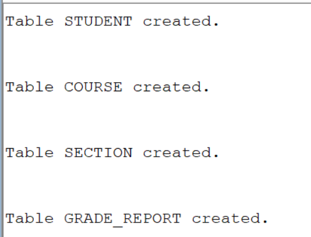
#1.insert all values into the table
```INSERT INTO STUDENT VALUES ('Smith', 17, 1, 'CS');

INSERT INTO STUDENT VALUES ('Brown', 8, 2, 'CS');
```
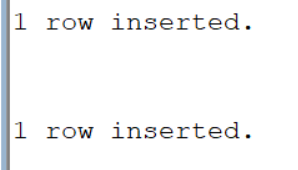
```INSERT INTO COURSE VALUES ('Intro to Computer Science', 'CS1310', 4, 'CS');

INSERT INTO COURSE VALUES ('Data Structures', 'CS3320', 4, 'CS');

INSERT INTO COURSE VALUES ('Discrete Mathematics', 'MATH2410', 3, 'MATH');

INSERT INTO COURSE VALUES ('Database', 'CS3380', 3, 'CS');
```
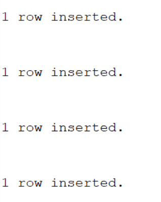
```INSERT INTO SECTION VALUES (85, 'MATH2410', 'Fall', 7, 'King');

INSERT INTO SECTION VALUES (92, 'CS1310', 'Fall', 7, 'Anderson');

INSERT INTO SECTION VALUES (102, 'CS3320', 'Spring', 8, 'Knuth');

INSERT INTO SECTION VALUES (112, 'MATH2410', 'Fall', 8, 'Chang');

INSERT INTO SECTION VALUES (119, 'CS1310', 'Fall', 8, 'Anderson');

INSERT INTO SECTION VALUES (135, 'CS3380', 'Fall', 8, 'Stone');
```

```INSERT INTO GRADE_REPORT VALUES (17, 112, 'B');

INSERT INTO GRADE_REPORT VALUES (17, 119, 'C');

INSERT INTO GRADE_REPORT VALUES (8, 85, 'A');

INSERT INTO GRADE_REPORT VALUES (8, 92, 'A');

INSERT INTO GRADE_REPORT VALUES (8, 102, 'B');

INSERT INTO GRADE_REPORT VALUES (8, 135, 'A');
```
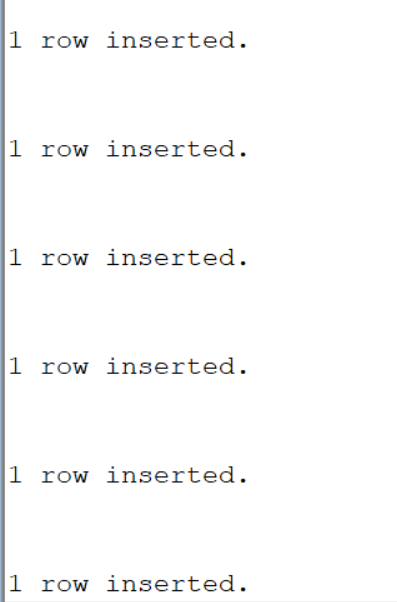

# 3.describe all tables
```DESC STUDENT;
DESC COURSE;
```
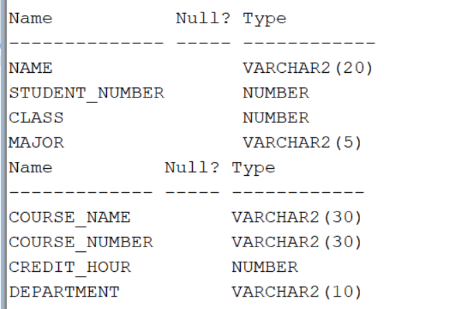
```DESC SECTION;
DESC GRADE_REPORT;
```
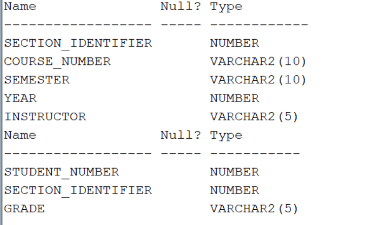
#4. list the created tables
```SELECT *FROM tab;```


#5.display values of each table
```SELECT * FROM STUDENT;```
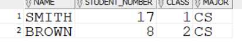
```SELECT * FROM COURSE;```
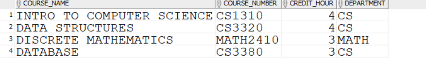
```SELECT * FROM SECTION;```
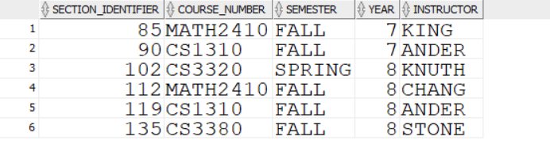
```SELECT * FROM GRADE_REPORT;```
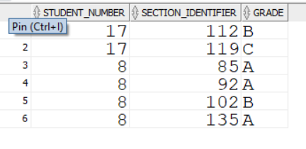
# 6.delete all tables
```DROP TABLE GRADE_REPORT;
DROP TABLE SECTION;
DROP TABLE COURSE;
DROP TABLE STUDENT;```
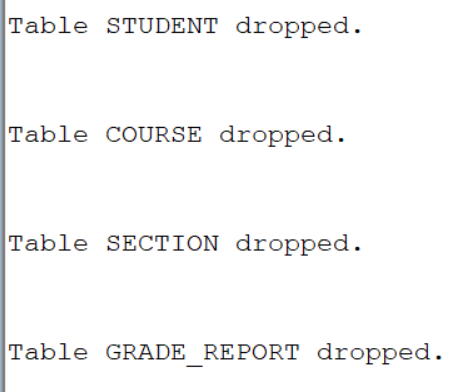
